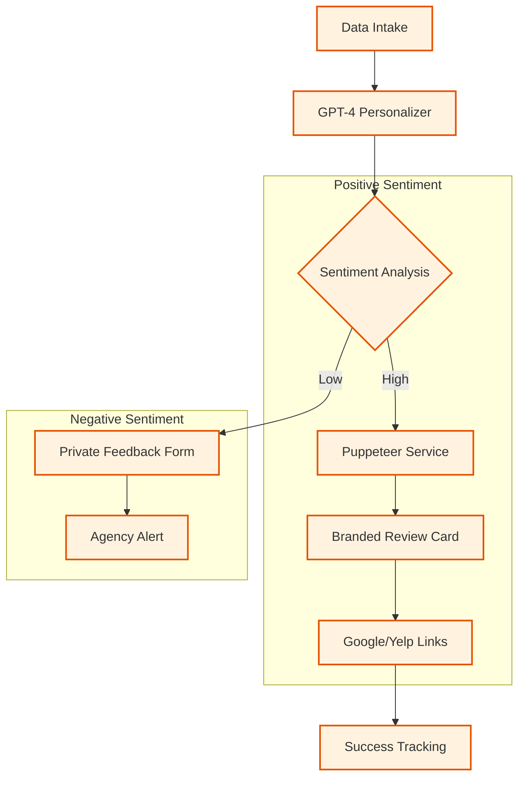

# 🏗️ Technical Architecture — reviewshield-ai

## Components
- **GPT-4 Personalizer**: Analyzes recent customer interactions to write unique, context-aware review requests that don't feel like templates.
- **Sentiment Gate**: An LLM-driven evaluator that predicts customer mood before sending them to public review platforms.
- **Puppeteer Rendering Service**: A microservice that takes tenant branding and generates high-resolution social proof images.

## Data Flow
1. **Intake**: Customer contact info and purchase history are fed into the system via API.
2. **Personalization**: GPT-4 drafts a message tailored to the specific purchase.
3. **Sentiment Check**: The customer's preliminary feedback is assessed.
4. **Routing**: Happy customers are prompted to review publicly; unhappy ones are directed to a private resolution channel.
5. **Branding**: The system applies white-label CSS/assets via Puppeteer to all generated visuals.

## Resilience & Compliance
- **Tenant Isolation**: Data is separated by tenant IDs to allow agency-scale operations.
- **Retry Cascades**: If Puppeteer fails to render a card, the system falls back to text-only links to ensure outreach continues.
- **Audit Logs**: Every outreach attempt is tracked to prevent "spamming" the same customer.

## Confidentiality
Source code for the Puppeteer rendering engine and the core white-label orchestration is withheld as it represents an active commercial asset.
