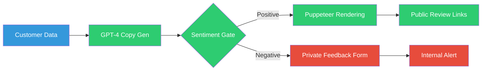

# Agencies: Scale Review Management with Brand Protection

 
 


**Client:** Marketing Agency | **Industry:** Marketing | **Delivered by:** K MD SAYAD RAHMAN (Sayad.dev | AI Automation)

<!-- Professional Banner -->


<!-- Interactive Architecture Diagram -->
[View Interactive Architecture Diagram](https://raw.githubusercontent.com/mdsadrhoman123-stack/reviewshield-ai/main/assets/diagrams/review-interactive.html)

---

## 🚀 Automation Portfolio by K MD SAYAD RAHMAN

Explore my AI automation systems across different industries

### 🏠 Real Estate AI Automation
[distressed-property-detection](https://github.com/mdsadrhoman123-stack/distressed-property-detection) - Property deal detection

### 🤝 M&A Deal-Flow Automation
[edugrow-ma-platform](https://github.com/mdsadrhoman123-stack/edugrow-ma-platform) - M&A advisory systems

### ☀️ Solar CRM Automation
[irish-solar-crm](https://github.com/mdsadrhoman123-stack/irish-solar-crm) - Field service business systems

### 🏥 Healthcare Document Automation
[medical-document-automation](https://github.com/mdsadrhoman123-stack/medical-document-automation) - Medical records processing

### 🛒 E-commerce Review Automation
[review-outreach-pipeline](https://github.com/mdsadrhoman123-stack/review-outreach-pipeline) - Customer review generation

### 🏢 Enterprise Intake Automation
[flowdesk](https://github.com/mdsadrhoman123-stack/flowdesk) - Enterprise intake systems

### 💳 Payment Reconciliation Automation
[paybridge](https://github.com/mdsadrhoman123-stack/paybridge) - Finance automation

### 📊 Executive Report Automation
[-impact-report-dashboard](https://github.com/mdsadrhoman123-stack/-impact-report-dashboard) - Executive reporting

---
**Contact:** khandokarsayad@gmail.com | mdsadrhoman123@gmail.com  
**LinkedIn:** [linkedin.com/in/khandokarsabbir](https://linkedin.com/in/khandokarsabbir)

---

## Contents

- [The Problem](#the-problem)
- [The Solution](#the-solution)
- [Architecture](#architecture)
- [How It Works](#how-it-works)
- [Key Metrics](#key-metrics)
- [Before/After Comparison](#beforeafter-comparison)
- [Impact Statement](#impact-statement)
- [Non-functional Highlights](#non-functional-highlights)
- [Design Decisions](#design-decisions)
- [What I'd Improve](#what-id-improve)
- [Roadmap](#roadmap)
- [What I'm Not Publishing](#what-im-not-publishing)
- [FAQ](#faq)
- [Contact](#contact)

---

## The Problem

Small businesses often struggle to ask for reviews consistently, while marketing agencies lack the scalable tools needed to offer automated review management as a white-label service. Negative feedback often goes public because there is no private vent mechanism.

**In practical terms:**
- Inconsistent review requests = **missed opportunities**
- Manual outreach = **not scalable for agencies**
- No sentiment filtering = **negative feedback goes public**
- Brand reputation risk = **one bad review can damage business**
- White-label challenges = **difficult to resell as agency service**

**The cost:** Missed positive reviews and potential brand damage from public negative feedback.

---

## The Solution

ReviewShield AI is a sophisticated outreach pipeline that uses AI to personalize customer requests and a sentiment gate to protect brand reputation. Positive feedback is channeled toward public platforms, while negative sentiment is captured privately for internal resolution.

**Core capabilities:**
- **AI-Personalized Outreach:** Every message generated by GPT-4 based on customer data
- **Sentiment-Based Routing:** Automatically filters feedback to protect brand reputation
- **Puppeteer Rendering:** Generates beautiful, branded review cards for social proof
- **Multi-Tenant Architecture:** Built for agency resale with per-client branding
- **Dual-Market Support:** Integrated pricing engine for different market segments

---

## Architecture



**Data Flow:**
1. **Intake:** Customer data collected from various sources
2. **Personalize:** GPT-4 generates personalized outreach messages
3. **Analyze:** Sentiment analysis determines feedback routing
4. **Route Positive:** Positive sentiment → public review platforms
5. **Route Negative:** Negative sentiment → private internal resolution
6. **Render:** Puppeteer generates branded review cards for social proof
7. **Alert:** Internal notifications for negative feedback requiring attention

---

## How It Works

### Step-by-Step Process:

1. **Customer Data Collection:** Gather customer information and interaction history
2. **AI Personalization:** GPT-4 generates tailored outreach messages based on customer data
3. **Message Delivery:** Personalized requests sent via appropriate channels
4. **Feedback Collection:** Customer responses collected and analyzed
5. **Sentiment Analysis:** AI determines emotional tone of customer feedback
6. **Intelligent Routing:** Positive feedback routed to public platforms, negative to private
7. **Brand Protection:** Negative sentiment captured internally before public posting
8. **Card Generation:** Puppeteer renders branded review cards for positive feedback
9. **Multi-Tenant Management:** Per-client branding and configuration maintained

### Technology Stack:
- **Orchestration:** n8n Workflow Automation (32 nodes)
- **AI Model:** OpenAI GPT-4 for personalized copy generation
- **Automation:** Puppeteer (Headless Chrome) for card rendering
- **Messaging:** SMS/Email APIs for customer outreach
- **Review Platforms:** Google & Yelp APIs for public review posting
- **System Type:** White-Label Review Management Pipeline

---

## Key Metrics

| Metric | Value |
| :--- | :--- |
| Pipeline Nodes | 32 |
| Markets | Dual-Market Support |
| Scalability | Unlimited Tenants |
| Brand Protection | Sentiment-Based Routing |

---

## Before/After Comparison

### BEFORE (Manual Review Management - Risky)
```
[Customer Interaction] 
    ↓ (manual tracking)
[Generic Request] 
    ↓ (no personalization)
[Public Posting] 
    ↓ (no filtering)
[Negative Feedback Public] 
    ↓ (brand damage)
[No Private Resolution] 
    ↓
= **Inconsistent requests, brand reputation risk, no scalability** ❌
```

### AFTER (Automated Review Pipeline - Protected)
```
[Customer Interaction] 
    ↓ (automated tracking)
[AI-Personalized Request] 
    ↓ (GPT-4 tailored)
[Sentiment Analysis] 
    ↓ (intelligent routing)
[Positive → Public] 
    ↓ (brand cards)
[Negative → Private] 
    ↓ (internal resolution)
[Multi-Tenant Management] 
    ↓
= **Consistent requests, brand protected, agency-scalable** ✅
```

**The difference:** AI-powered review management with sentiment-based brand protection and white-label scalability.

---

## Impact Statement

**Business Value Delivered:**
- **AI personalization** increases review request effectiveness
- **Sentiment-based routing** protects brand reputation from public negative feedback
- **White-label architecture** enables agency resale and scalability
- **Automated consistency** ensures no customer interaction missed
- **Brand card generation** creates professional social proof materials

**Client ROI:** White-label solution that agencies can resell while protecting client brands through intelligent sentiment routing.

---

## Non-functional Highlights

**Reliability & Error Handling:**
- **Sentiment Analysis Accuracy:** AI-driven routing protects brand reputation
- **Multi-Tenant Isolation:** Per-client data separation for white-label service
- **Explicit Error Handling:** Failed outreach triggers retry logic
- **Production-Grade:** Built for agency-scale operations

**Performance:**
- **32-node pipeline** handles complex review management workflows
- **AI personalization** improves response rates vs generic messaging
- **Scalable architecture** supports unlimited tenant expansion

**Brand Protection:**
- **Sentiment Gate:** Negative feedback captured before public posting
- **Private Resolution:** Internal alerts for negative sentiment requiring attention
- **Professional Rendering:** Branded cards for positive social proof

---

## Design Decisions

**Why This Architecture:**
- **Sentiment-Based Routing:** Protects brand reputation by filtering negative feedback
- **AI Personalization:** GPT-4 increases effectiveness vs generic templates
- **Puppeteer Rendering:** Professional branded cards for social proof
- **Multi-Tenant Design:** White-label architecture for agency resale
- **Dual-Market Support:** Integrated pricing for different market segments

**Trade-offs:**
- **AI Cost vs Quality:** GPT-4 personalization increases cost but improves effectiveness
- **Complexity vs Capability:** 32 nodes provide comprehensive review management
- **Sentiment Accuracy vs False Positives:** Balance between brand protection and missed positive reviews

---

## What I'd Improve

With more time/budget:
- **Advanced Sentiment Analysis:** Fine-tuned models for industry-specific sentiment
- **Multi-Platform Expansion:** Additional review platforms beyond Google/Yelp
- **Analytics Dashboard:** Review performance tracking and insights
- **Automated Response:** AI-generated responses to customer feedback
- **Integration Expansion:** CRM and business system integrations

---

## Roadmap

- [ ] **v2.0:** Advanced sentiment analysis for industry-specific accuracy
- [ ] **Multi-Platform:** Additional review platform integrations
- [ ] **Analytics Dashboard:** Review performance tracking and insights
- [ ] **Automated Response:** AI-generated response suggestions
- [ ] **CRM Integration:** Direct business system connections

---

## What I'm Not Publishing

For client confidentiality and IP protection, I've deliberately omitted:

- Workflow exports and microservice source code (active sellable asset)
- Client account lists and outreach data
- Tenant-specific branding rules and templates
- Proprietary sentiment analysis algorithms
- Integration authentication details
- Pricing models and client configurations

**This is a real client system for marketing agencies. White-label confidentiality applies.**

---

## FAQ

**Q: How does the sentiment gate work?**  
A: AI analyzes customer feedback sentiment; positive routes to public platforms, negative to private resolution.

**Q: Can this be white-labeled for multiple agencies?**  
A: Yes, multi-tenant architecture supports unlimited agency clients with per-client branding.

**Q: What review platforms are supported?**  
A: Currently Google and Yelp APIs, can be extended to additional platforms.

**Q: How accurate is the sentiment analysis?**  
A: GPT-4 provides high-accuracy sentiment classification for brand protection.

---

## Contact

**K MD SAYAD RAHMAN** - Sayad.dev | AI Automation

**Work Email:** khandokarsayad@gmail.com  
**Personal Email:** mdsadrhoman123@gmail.com  
**LinkedIn:** https://linkedin.com/in/khandokarsabbir  
**GitHub:** https://github.com/mdsadrhoman123-stack

**Open to Work - Accepting New Automation Projects**

**Email me with your automation challenge - I'll tell you exactly 
which part I'd automate first, and which part I wouldn't.**

---

## See My Other Automation Systems

- [Real Estate AI Automation](../distressed-property-detection) - Property deal detection
- [M&A Deal-Flow Automation](../edugrow-ma-platform) - M&A advisory systems
- [Healthcare Document Automation](../medical-document-automation) - Medical records processing
- [E-commerce Review Automation](../review-outreach-pipeline) - Customer review generation

---

<div align="center">

**Built by K MD SAYAD RAHMAN (Sayad.dev | AI Automation)**

**Contact:** khandokarsayad@gmail.com | mdsadrhoman123@gmail.com

Copyright (c) 2024 K MD SAYAD RAHMAN. All rights reserved. Portfolio use only.

*[n8n](https://n8n.io) | [GPT-4](https://openai.com) | [Marketing Automation](https://linkedin.com/in/khandokarsabbir)*

</div>