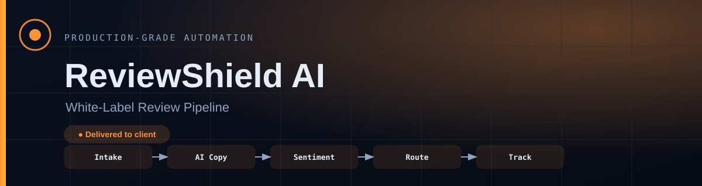

# ReviewShield AI

**Happy customers are asked at the right moment and sent to a public review. Unhappy ones are routed to a private form before they ever reach Google.**

    

> [!NOTE]
> **Where this system comes from.** Businesses in this sector post this problem publicly, in their own words — job briefs on Upwork and Fiverr. I took the brief as the specification, designed a system for the problem exactly as stated, and built it to production standard on my own infrastructure. Nothing in it was added to look impressive: every part of it answers something in the brief.
>
> It was built as a product rather than a one-off — built once, ready to deploy for any business with this problem. **It has not been sold or deployed into a customer's business: it is available, not delivered.** What follows is the real system — how it works, how it fails, and what it does not do.

| | |
| :--- | :--- |
| **Built for** | Agencies reselling to local businesses |
| **The brief** | Real briefs, posted publicly — businesses in this sector describing this exact problem in their own words, on Upwork and Fiverr |
| **Industry** | Local business / agency resale |
| **Status** | running on my own n8n |
| **My role** | Sole engineer — I read the brief, scoped it, designed the system, built it and ran it |
| **Availability** | Ready to deploy — built to production standard and running on my own infrastructure. Not sold, and not running inside a customer's business. |

---

### On this page

[The problem](#the-problem) · [What changed](#what-changed) · [How it works](#how-it-works) · [When it breaks](#when-it-breaks) · [The stack](#the-stack) · [Limitations](#honest-limitations) · [Read deeper](#read-deeper)

---

## The problem

Local businesses know reviews drive revenue, but asking for them consistently is a manual task that is easily forgotten.

Happy customers rarely leave a review unless asked at the right moment in the right way. Manual outreach does not scale past a handful a week, and a generic “please review us” gets ignored.

Agencies want to sell review management as a service without running it by hand for every client — which means the system has to be deployable per client, not rebuilt per client.

## What changed

| | Before | After |
| :--- | :--- | :--- |
| **Who gets asked** | Whoever staff remembers | Every customer, at a set interval |
| **The message** | One template for everyone | Written per customer |
| **Negative feedback** | Lands on Google publicly | Intercepted to a private form first |
| **Scaling to 10 clients** | Ten manual processes | Ten deployed instances of one system |
| **Non-responders** | Forgotten | Follow-up sequence |

Before/after describes the change in process, not benchmarked throughput. Where a number is not measured, it is not claimed.

## How it works

A timed outreach sequence generates a personalised message and a branded review card per customer. Response sentiment decides the route: positive goes to the public review link, negative goes to a private feedback form.

<table>
<tr>
<td width="42" valign="top" align="center"><b>01</b></td><td valign="top"><b>A customer finishes</b> The trigger is the completed purchase or service, not a marketing calendar.</td>
</tr>
<tr>
<td width="42" valign="top" align="center"><b>02</b></td><td valign="top"><b>The ask waits</b> A delay puts the request at the moment the customer is most likely to act.</td>
</tr>
<tr>
<td width="42" valign="top" align="center"><b>03</b></td><td valign="top"><b>The ask is personal</b> Copy is generated for that customer, and arrives as a branded card rather than plain text.</td>
</tr>
<tr>
<td width="42" valign="top" align="center"><b>04</b></td><td valign="top"><b>Sentiment decides</b> This is the design decision that matters: the route depends on how the customer actually feels.</td>
</tr>
<tr>
<td width="42" valign="top" align="center"><b>05</b></td><td valign="top"><b>Happy goes public</b> Straight to the review link, with no extra steps to lose them.</td>
</tr>
<tr>
<td width="42" valign="top" align="center"><b>06</b></td><td valign="top"><b>Unhappy stays private</b> Routed to a private form. The client learns about the problem; the public rating does not take the hit.</td>
</tr>
<tr>
<td width="42" valign="top" align="center"><b>07</b></td><td valign="top"><b>Silence gets a nudge</b> Non-responders enter a follow-up sequence instead of being dropped.</td>
</tr>
</table>

### How it flows

What happens to the client's work, in the order they experience it. The internal build — node graph, execution order, prompts, thresholds — is deliberately not published.

<b>What the shapes mean</b> — colour is not the only signal

| Shape | Means |
| :--- | :--- |
| **rounded** | Where the client's process starts |
| **box** | Something the system does |
| **diamond** | A decision point |
| **slanted** | A person has to act |
| **green box** | The good outcome |
| **red box** | Failure path — held, escalated or alerted |

Red appears in exactly one role across every repo in this portfolio: where failure goes. Nowhere else. If you see red, something is being held, escalated or alerted.

> **Walk it interactively** — [`docs/index.html`](docs/index.html) is a single self-contained page. Download it, open it in any browser, and press **Break it** to watch the failure path light up. Nothing to install, no network calls.

## When it breaks

Most automation portfolios show you the happy path. The happy path is the easy half. This is the half that decides whether a system survives contact with a real business.

| What goes wrong | How it is detected | What the system does | Who finds out |
| :--- | :--- | :--- | :--- |
| **Customer is unhappy** | Response sentiment | Routed to a private form, not the public review link | The client sees the feedback internally |
| **No response at all** | Response window elapses | Automated follow-up sequence rather than a dead end | Nobody — handled |
| **Card render fails** | Render step error | Send falls back to text rather than not sending | Alert on the failed render |
| **Send is rejected** | Provider response | Retry with backoff, then hold | Alert with the customer record |
| **Duplicate trigger for one customer** | Record check before send | Second send suppressed | Nobody — by design |

The default on an unhandled condition is to **stop and tell someone** — never to continue on a guess. A silent success is the failure mode that costs the most, because nobody goes looking for it.

## The stack

| Component | Why this one |
| :--- | :--- |
| **n8n** | Orchestration, deployed per client instance |
| **Puppeteer** | Renders the branded review card as an image |
| **OpenAI GPT-4** | Writes the outreach copy per customer instead of a template |
| **Email / SMS APIs** | Delivery |
| **Google / Yelp Review APIs** | Where a positive response is sent |

### Counted, not estimated

| | |
| :--- | :--- |
| Workflow nodes | **32** |
| Pricing tiers built in | **2  (BD + global)** |
| Per-client isolation | **Yes** |

These are counts from the built system — nodes, stages, versions, gates. No efficiency percentages are published here without a stated measurement method.

### Also worth knowing

- Branding, tone and outreach timing are configurable per deployed client instance, so an agency can run many clients off one system.

## Honest limitations

Every design decision costs something. These are the trade-offs in this build, stated by the person who made them.

- Sentiment routing is a judgement made from the customer's reply. A short or ambiguous reply can route imperfectly, so the private form is the safer default.
- Review platform terms differ on how customers may be directed. Configuration must be checked per market before deployment.
- The Puppeteer renderer is a separate service. It is one more thing to keep running than a pure n8n build.

## What is not in this repo

- **Data belonging to a real business.** None, in any form. Not anonymised, not sampled — there never was any.
- **Credentials and endpoints.** Never committed. See [`NOTICE.md`](NOTICE.md).
- **The workflow itself.** No exports, no node graph, no execution order, no prompts, no scoring thresholds, no integration wiring — not sanitised, not partial, not in a screenshot. That is the build, and the build is not portfolio material.

This repository documents *how the problem was thought about* — the failure paths, the trade-offs, the reasoning. That is what tells you whether to hire someone. A copy of the wiring would not.

This is a portfolio repository documenting a system I designed and built. It is not a product you can clone and run against your own accounts.

## Read deeper

| | |
| :--- | :--- |
| [01 · The problem](docs/01-problem.md) | The situation before, in full |
| [02 · The journey](docs/02-journey.md) | Step by step, from their side |
| [03 · Architecture](docs/03-architecture.md) | Diagrams and the reasoning |
| [04 · Failure handling](docs/04-failure-handling.md) | Every path, and where it lands |
| [05 · The stack](docs/05-stack.md) | What was chosen and what was rejected |
| [06 · Results](docs/06-results.md) | What is measured and what is not |
| [07 · Limitations](docs/07-limitations.md) | The trade-offs, in detail |

---

### Tell me what the process is

I will tell you honestly whether automating it is worth your money — including when the answer is no.

**K MD SAYAD RAHMAN** — AI Automation Engineer  
n8n · AI agents · production reliability  
[khandokarsayad@gmail.com](mailto:khandokarsayad@gmail.com) · [mdsadrhoman123@gmail.com](mailto:mdsadrhoman123@gmail.com) · [LinkedIn](https://www.linkedin.com/in/khandokarsayad) · [More systems](https://github.com/mdsadrhoman123-stack)

