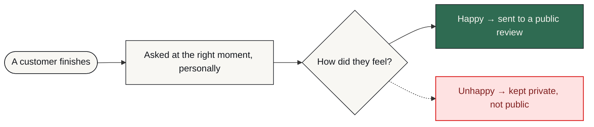

# ReviewShield AI

**Happy customers are asked at the right moment and sent to a public review. Unhappy ones are routed to a private form before they ever reach Google.**

     [](https://github.com/mdsadrhoman123-stack/reviewshield-ai/actions/workflows/honesty-check.yml)

> [!NOTE]
> **What this is.** A production-grade system built to a brief that businesses in this sector post publicly, in their own words — the problem exactly as they stated it, not one invented to demonstrate something. It was engineered the way anything a business actually depends on has to be: the failure paths designed before the features, every one of them logged and alerted rather than left to chance. It runs on my own infrastructure. It is ready to deploy for any business with this problem, and it has not been sold or deployed into a customer's business yet.

| | |
| :--- | :--- |
| **Built for** | Agencies reselling to local businesses |
| **The brief** | The problem exactly as businesses in this sector post it — public job briefs on Upwork and Fiverr, in their words, not my framing |
| **Industry** | Local business / agency resale |
| **Status** | running on my own n8n |
| **Failure paths designed** | 5 — each with how it is detected, what the system does about it, and who finds out |
| **My role** | Sole engineer — scoping, architecture, build, failure design and operation |
| **Availability** | Ready to deploy for any business with this problem — built once as a product, not as a one-off. Running on my own infrastructure; not sold yet. |

---

### On this page

[The problem](#the-problem) · [What changed](#what-changed) · [How it works](#how-it-works) · [The shape of it](#the-shape-of-the-system) · [When it breaks](#when-it-breaks) · [Why this way](#why-it-is-built-this-way) · [Limitations](#honest-limitations) · [What is here](#what-is-in-this-repository) · [Read deeper](#read-deeper)

---

## The problem

Local businesses know reviews drive revenue, but asking for them consistently is a manual task that is easily forgotten.

Happy customers rarely leave a review unless asked at the right moment in the right way. Manual outreach does not scale past a handful a week, and a generic “please review us” gets ignored.

Agencies want to sell review management as a service without running it by hand for every client — which means the system has to be deployable per client, not rebuilt per client.

## What changed

| | Before | After |
| :--- | :--- | :--- |
| **Who gets asked** | Whoever staff remembers | Every customer, at a set interval |
| **The message** | One template for everyone | Written per customer |
| **Negative feedback** | Lands on Google publicly | Intercepted to a private form first |
| **Scaling to 10 clients** | Ten manual processes | Ten deployed instances of one system |
| **Non-responders** | Forgotten | Follow-up sequence |

<sub>Before/after describes the change in process, not benchmarked throughput. Where a number is not measured, it is not claimed.</sub>

## How it works

A timed outreach sequence generates a personalised message and a branded review card per customer. Response sentiment decides the route: positive goes to the public review link, negative goes to a private feedback form.

<table>
<tr>
<td width="42" valign="top" align="center"><b>01</b></td><td valign="top"><b>A customer finishes</b><br>The trigger is the completed purchase or service, not a marketing calendar.</td>
</tr>
<tr>
<td width="42" valign="top" align="center"><b>02</b></td><td valign="top"><b>The ask waits</b><br>A delay puts the request at the moment the customer is most likely to act.</td>
</tr>
<tr>
<td width="42" valign="top" align="center"><b>03</b></td><td valign="top"><b>The ask is personal</b><br>Copy is generated for that customer, and arrives as a branded card rather than plain text.</td>
</tr>
<tr>
<td width="42" valign="top" align="center"><b>04</b></td><td valign="top"><b>Sentiment decides</b><br>This is the design decision that matters: the route depends on how the customer actually feels.</td>
</tr>
<tr>
<td width="42" valign="top" align="center"><b>05</b></td><td valign="top"><b>Happy goes public</b><br>Straight to the review link, with no extra steps to lose them.</td>
</tr>
<tr>
<td width="42" valign="top" align="center"><b>06</b></td><td valign="top"><b>Unhappy stays private</b><br>Routed to a private form. The client learns about the problem; the public rating does not take the hit.</td>
</tr>
<tr>
<td width="42" valign="top" align="center"><b>07</b></td><td valign="top"><b>Silence gets a nudge</b><br>Non-responders enter a follow-up sequence instead of being dropped.</td>
</tr>
</table>

### How it flows

<sub>What happens to the client's work, in the order they experience it. The internal build — node graph, execution order, prompts, thresholds — is deliberately not published.</sub>



<details>
<summary><b>What the shapes mean</b> — colour is not the only signal</summary>

| Shape | Means |
| :--- | :--- |
| **rounded** | Where the client's process starts |
| **box** | Something the system does |
| **diamond** | A decision point |
| **slanted** | A person has to act |
| **green box** | The good outcome |
| **red box** | Failure path — held, escalated or alerted |

Red appears in exactly one role across every repo in this portfolio: where failure goes. Nowhere else. If you see red, something is being held, escalated or alerted.
</details>

> **Walk it interactively** — [`docs/index.html`](docs/index.html) is a single self-contained page. Download it, open it in any browser, and press **Break it** to watch the failure path light up. Nothing to install, no network calls.

## The shape of the system

Parts and the role each one plays. Not the wiring — no execution order, no prompt text, no thresholds. That is a deliberate line, and the last branch of the tree names exactly what sits on the other side of it.

```text
ReviewShield AI — the running system
│
├── Interfaces ...................... the systems it talks to
│   ├── Email / SMS APIs ............ Delivery
│   └── Google / Yelp Review APIs ... Where a positive response is sent
│
├── Judgement ....................... where a decision or a piece of writing is made
│   └── OpenAI GPT-4 ................ Writes the outreach copy per customer instead of a template
│
├── Documents ....................... files becoming data, and data becoming files
│   └── Puppeteer ................... Renders the branded review card as an image
│
├── Ground .......................... what the whole thing runs on
│   └── n8n ......................... Orchestration, deployed per client instance
│
├── Failure design .................. 5 paths, designed before the features
│   ├── detected by ................. an error output, a timer, or a failed connection
│   ├── handled by .................. falling back, holding, or halting — never guessing
│   └── announced to ................ a named person, with the reason attached
│
└── Not in this repository .......... the part that would let you skip the thinking
    ├── the node graph .............. which part runs after which, and on what condition
    ├── the prompts ................. wording, guardrails, the shape of the output
    ├── the thresholds .............. what counts as urgent, late, at capacity, a match
    └── the credentials ............. never committed, in any form, at any point
```

Read it as a set of decisions rather than a parts list. Every part is there because a specific failure or a specific constraint put it there, and the two sections below are the same story told twice: **When it breaks** is what each part is defending against, and **Honest limitations** is what it costs to have chosen that part and not another.

### Counted, not estimated

| | |
| :--- | :--- |
| Workflow nodes | **32** |
| Pricing tiers built in | **2  (BD + global)** |
| Per-client isolation | **Yes** |

<sub>These are counts from the built system — nodes, stages, versions, gates. No efficiency percentages are published here without a stated measurement method.</sub>

### Also worth knowing

- Branding, tone and outreach timing are configurable per deployed client instance, so an agency can run many clients off one system.

## When it breaks

Most automation portfolios show you the happy path. The happy path is the easy half. This is the half that decides whether a system survives contact with a real business.

| What goes wrong | How it is detected | What the system does | Who finds out |
| :--- | :--- | :--- | :--- |
| **Customer is unhappy** | Response sentiment | Routed to a private form, not the public review link | The client sees the feedback internally |
| **No response at all** | Response window elapses | Automated follow-up sequence rather than a dead end | Nobody — handled |
| **Card render fails** | Render step error | Send falls back to text rather than not sending | Alert on the failed render |
| **Send is rejected** | Provider response | Retry with backoff, then hold | Alert with the customer record |
| **Duplicate trigger for one customer** | Record check before send | Second send suppressed | Nobody — by design |

The default on an unhandled condition is to **stop and tell someone** — never to continue on a guess. A silent success is the failure mode that costs the most, because nobody goes looking for it.

## Why it is built this way

Three decisions, each with the option that was turned down and the price of turning it down. A choice with no cost attached to it was not a choice — it was a default, and defaults are not worth reading about.

<details open>
<summary><b>Why sentiment picks the route, and why the private form is the default</b></summary>

**What it does.** The customer's reply decides where they go: positive to the public review link, negative to a private feedback form.

**What was turned down.** Sending everyone to the public link. It would lift the review count immediately — and an unhappy customer directed to a public page is a complaint published at the client's own expense.

**What that costs.** A short or ambiguous reply can route imperfectly, so the safe side has to be the default. Some genuinely positive replies go private and never become a public review. That is the cost of not risking the other error.

</details>

<details>
<summary><b>Why the review card is rendered by a browser</b></summary>

**What it does.** Puppeteer renders the branded card from real markup, so the card matches the brand the client already has.

**What was turned down.** A templated image service. Fewer moving parts and no browser to keep alive — and the card is then locked to that service's template language, which is a bad place for a client's brand to live.

**What that costs.** A separate renderer service to keep running. One more thing than a pure n8n build, and it is the part most likely to need a restart.

</details>

<details>
<summary><b>Why the outreach copy is written per customer</b></summary>

**What it does.** Each message is written against that customer's actual interaction rather than filled into a template.

**What was turned down.** A template with merge fields. Cheap, deterministic, and it reads as bulk mail — which defeats the purpose of asking someone for a personal favour.

**What that costs.** A provider call per customer, with the cost and the variance that implies. Review platform terms also differ by market on how customers may be directed, so configuration has to be checked per market before deployment.

</details>

Every cost above also appears in **Honest limitations** below. It is there twice on purpose: once as the reasoning, once as the consequence, so neither can be quietly dropped from the other.

## Honest limitations

Every design decision costs something. These are the trade-offs in this build, stated by the person who made them.

- Sentiment routing is a judgement made from the customer's reply. A short or ambiguous reply can route imperfectly, so the private form is the safer default.
- Review platform terms differ on how customers may be directed. Configuration must be checked per market before deployment.
- The Puppeteer renderer is a separate service. It is one more thing to keep running than a pure n8n build.

## What is in this repository

Every file, and the question it answers. Same layout in all eleven repositories in this portfolio, so the second one you open needs no orientation at all.

```text
reviewshield-ai/
├── README.md ....................... ← you are here
├── SECURITY.md ..................... how to report something that should not be public
├── NOTICE.md ....................... what is withheld, and why
├── LICENSE ......................... covers the documentation, not a software grant
│
├── docs/ ........................... the long form — read in order or not at all
│   ├── index.html .................. the interactive demo, one file, no network
│   ├── 01-problem.md ............... the situation before, in full
│   ├── 02-journey.md ............... step by step, from their side
│   ├── 03-architecture.md .......... the diagrams, and why they are shaped that way
│   ├── 04-failure-handling.md ...... every failure path, and where it lands
│   ├── 05-stack.md ................. each choice, the option turned down, the cost
│   ├── 06-results.md ............... what is measured, and what is deliberately not
│   └── 07-limitations.md ........... the trade-offs, in detail
│
├── diagrams/ ....................... source, so the flow can be re-rendered
│   ├── pipeline-lr.mmd ............. the client-level flow, left to right
│   └── pipeline-tb.mmd ............. the same flow, top to bottom
│
├── assets/ ......................... SVG only — nothing loaded from a CDN
│   ├── banner.svg .................. the header on this page
│   └── cta.svg ..................... the closing card
│
├── workflows/ ...................... empty on purpose — see below
│   └── README.md ................... why it is empty, in writing
│
└── .github/ ........................ the badge at the top of this page
    ├── honesty-check.py ............ the claim linter it runs
    └── workflows/
        └── honesty-check.yml ....... runs it on every push
```

There is no `src/` in that tree, and no `workflows/*.json`. That is not an omission — it is the design, and the next section says exactly what is being withheld and why.

## What is not in this repo

- **Data belonging to a real business.** None, in any form. Not anonymised, not sampled — there never was any.
- **Credentials and endpoints.** Never committed. See [`NOTICE.md`](NOTICE.md) for what is withheld, and [`SECURITY.md`](SECURITY.md) for how to report anything that slipped through.
- **The workflow itself.** No exports, no node graph, no execution order, no prompts, no scoring thresholds, no integration wiring — not sanitised, not partial, not in a screenshot. That is the build, and the build is not portfolio material.

This repository documents *how the problem was thought about* — the failure paths, the trade-offs, the reasoning. That is what tells you whether to hire someone. A copy of the wiring would not.

This is a portfolio repository documenting a system I designed and built. It is not a product you can clone and run against your own accounts.

## Read deeper

| | |
| :--- | :--- |
| [01 · The problem](docs/01-problem.md) | The situation before, in full |
| [02 · The journey](docs/02-journey.md) | Step by step, from their side |
| [03 · Architecture](docs/03-architecture.md) | Diagrams and the reasoning |
| [04 · Failure handling](docs/04-failure-handling.md) | Every path, and where it lands |
| [05 · The stack](docs/05-stack.md) | What was chosen and what was rejected |
| [06 · Results](docs/06-results.md) | What is measured and what is not |
| [07 · Limitations](docs/07-limitations.md) | The trade-offs, in detail |

---


### Tell me what the process is

I will tell you honestly whether automating it is worth your money — including when the answer is no.

**K MD SAYAD RAHMAN** — AI Automation Engineer  
n8n · AI agents · production reliability  
[khandokarsayad@gmail.com](mailto:khandokarsayad@gmail.com) · [mdsadrhoman123@gmail.com](mailto:mdsadrhoman123@gmail.com) · [LinkedIn](https://www.linkedin.com/in/khandokarsayad) · [More systems](https://github.com/mdsadrhoman123-stack)

