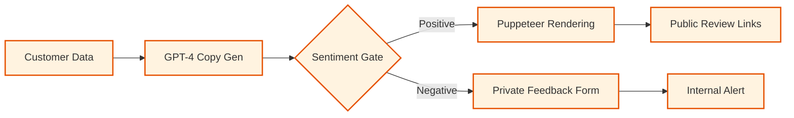
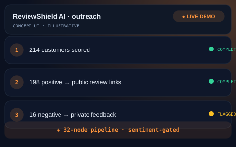

# 🛡️ ReviewShield AI — White-Label Review Pipeline
> White-label review generation pipeline — turns satisfied customers into public 5-star reviews.

   

## The Problem
Small businesses often struggle to ask for reviews consistently, while marketing agencies lack the scalable tools needed to offer automated review management as a white-label service. Negative feedback often goes public because there is no private vent mechanism.

## The Solution
ReviewShield-AI is a sophisticated outreach pipeline that uses AI to personalize customer requests and a sentiment gate to protect public ratings. Positive feedback is channeled toward public platforms, while negative sentiment is captured privately for internal resolution.
- **AI-Personalized Outreach**: Every message is generated by GPT-4 based on customer data.
- **Sentiment-Based Routing**: Automatically filters feedback to protect brand reputation.
- **Puppeteer Rendering**: Generates beautiful, branded review cards for social proof.
- **Multi-Tenant Architecture**: Built for agency resale with per-client branding.

## Architecture at a Glance

## Key Metrics
| Metric | Value |
| :--- | :--- |
| Pipeline Nodes | 32 |
| Markets | Dual-Market Support |
| Scalability | Unlimited Tenants |

## What Was Built
- [x] AI-personalized outreach copy engine.
- [x] Puppeteer-based branded card rendering.
- [x] Sentiment-based routing logic.
- [x] Multi-tenant white-label configuration.
- [x] Integrated pricing engine for dual-market support.

## Deliberately Not Published
- [ ] Workflow exports & microservice source code (active sellable asset).
- [ ] Client account lists and outreach data.
- [ ] Tenant-specific branding rules and templates.

This repository is a portfolio presentation. No proprietary workflows, source code, or client data are published — by design.

## See It in Action

> Illustrative concept UI — a visual walkthrough of the workflow. Not a production screenshot.

## Tech Stack
- **Orchestration**: n8n
- **AI Model**: OpenAI GPT-4
- **Automation**: Puppeteer (Headless Chrome)
- **Messaging**: SMS/Email APIs
- **Review Platforms**: Google & Yelp APIs

[Architecture Deep-Dive](ARCHITECTURE.md) · [Case Study](CASE-STUDY.md)

---
Built by Sabbir — AI Automation Engineer · Production-grade automation, not templates
